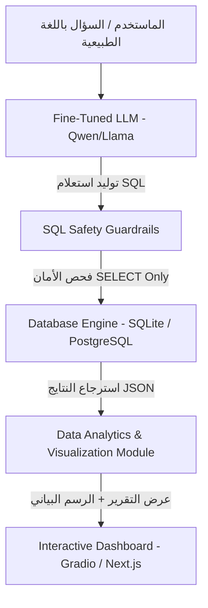

# 🚀 Enterprise Text-to-SQL & Analytics Agent (Fine-Tuned LLM)


نظام ذكاء اصطناعي متكامل يعتمد على **Fine-Tuning** لنموذج مفتوح المصدر (Open-Source LLM) تحويل الأسئلة والاستفسارات باللغة الطبيعية (العربية والإنجليزي) إلى استعلامات **SQL** معقدة بدقة عالية، مع تنفيذها بأمان على قواعد البيانات وعرض النتائج في لوحة تحكم تفاعلية مع رسوم بيانية تلقائية.

---

## 📌 1. المفهوم والقيمة التجارية (Business Value)

تصل نسبة كبيرة من طلبات استخراج التقارير في الشركات إلى أقسام تحليل البيانات والتطوير. يهدف هذا المشروع إلى:
- **تمكين غير التقنيين:** تمكين المديرين ومسؤولي المبيعات من استعلام قواعد البيانات باللغة الطبيعية.
- **الحفاظ على الخصوصية والأمان:** عدم إرسال بيانات الشريكة أو هيكلها (Schema) لـ APIs خارجية مكلفة.
- **الدقة العالية والسرعة:** خفض نسبة الأخطاء في الاستعلامات المعقدة (Multi-table JOINs, Aggregations) عبر دمج Fine-Tuning مخصص مع طبقة أمان (Guardrails).

---

## 🏗️ 2. المعمارية التقنية (Architecture & Workflow)



---

## 🛠️ 3. الأدوات والتكنولوجيات المستخدمة (Tech Stack)

* **Model Fine-Tuning:** `Unsloth`, `QLoRA`, `bitsandbytes`, `TRL` (Hugging Face)
* **Base Models:** `Qwen/Qwen2.5-Coder-3B-Instruct` / `Llama-3.1-8B-Instruct`
* **Dataset:** `Spider Dataset` / Custom E-Commerce Text-to-SQL Dataset
* **Database Engine:** `SQLite3` (مرحلة الـ POC) / `PostgreSQL` (الإنتاج)
* **Backend & Logic:** `Python 3.10+`, `FastAPI`, `Pandas`
* **UI & Visualization:** `Gradio` (داخل كولاب) -> `Next.js` + `Recharts`
* **Cloud & MLOps:** `Google Colab T4 GPU`, `Hugging Face Hub`, `GitHub`

---

## 🗺️ 4. خطة التنفيذ الكاملة (Project Execution Roadmap)

### 🔹 المرحلة الأولى: التجهيز والـ Baseline
- [x] إعداد مستودع GitHub والربط مع Google Colab.
- [x] إنشاء قاعدة بيانات تجريبية (Ecommerce Schema: Customers, Products, Orders).
- [x] اختبار النموذج الأساسي (Base Model) بدون Fine-tuning وقياس نسبة الخطأ.

### 🔹 المرحلة الثانية: الـ Fine-Tuning والتدريب
- [ ] تجهيز الـ Dataset (`Spider` أو مخصصة) وتنسيقها بصيغة Instruction-Output.
- [ ] تدريب النموذج باستعمال `Unsloth` على كولاب مع تقنية `QLoRA`.
- [ ] تقليل استهلاك الذاكرة وحفظ Weights/Adapter.
- [ ] رفع النموذج المدرب إلى حساب **Hugging Face Hub**.

### 🔹 المرحلة الثالثة: طبقة الأمان وتنفيذ الاستعلام (Guardrails & Execution)
- [ ] بناء وحدات فحص الاستعلام (SQL Parser) لمنع أي استعلامات مخربة (`DROP`, `DELETE`, `UPDATE`).
- [ ] تنفيذ الاستعلام واسترجاع البيانات بصيغة JSON structured.

### 🔹 المرحلة الرابعة: الواجهة والعرض (Visualization UI)
- [ ] بناء واجهة Gradio تفاعلية تعمل داخل Colab كـ POC.
- [ ] ربط البيانات المرجعة بـ Matplotlib/Recharts لرسم البيانات أوتوماتيكياً حسب نوع النتيجة.

### 🔹 المرحلة الخامسة: التقييم والتوثيق (Evals & Documentation)
- [ ] قياس **Execution Accuracy** مقارنة بالاستعلامات الصحيحة.
- [ ] توثيق المشروع بالفيديو ورفعه على GitHub لدعم الـ CV.

---

## 🔗 5. طريقة ربط Google Colab بـ GitHub وإدارة الكود

لاستخدام Google Colab في العمل بدون الحاجة لتنزل أي شيء على جهازك المحلي، اتبع الخطوات التالية:

### الخطوة 1: تجهيز Personal Access Token (PAT) على GitHub
1. اذهب إلى GitHub -> **Settings** -> **Developer Settings** -> **Personal Access Tokens** -> **Tokens (classic)**.
2. اختر **Generate new token (classic)**.
3. حدد الصلاحية `repo` بالكامل.
4. انسخ التوكين الناتج (احتفظ به في مكان آمن).

### الخطوة 2: أوامر الربط وتشغيل Git من داخل Google Colab
قم بفتح نوت بوك Colab واكتب الأوامر التالية في خلية (Cell):

```python
# 1. تعريف بيانات المستخدم في Git
!git config --global user.name "اسمك على جيت هب"
!git config --global user.email "إيميلك على جيت هب"

# 2. استคลون الريبو لداخل كولاب (استبدل البيانات بحسابك والتوكين)
# Format: https://<TOKEN>@github.com/<USERNAME>/<REPO_NAME>.git
import os

GITHUB_TOKEN = "ضع_التوكين_هنا"
USERNAME = "اسم_حسابك"
REPO_NAME = "اسم_الريبو"

!git clone https://{GITHUB_TOKEN}@github.com/{USERNAME}/{REPO_NAME}.git

# 3. الانتقال لمجلد المستودع داخل كولاب
%cd {REPO_NAME}
```

### الخطوة 3: حفظ التعديلات ورفعها لـ GitHub من Colab
بعد تعديل أو إضافة أي ملفات (مثل ملفات Python أو README) داخل Colab:

```python
# فحص حالة الملفات
!git status

# إضافة كافة التعديلات
!git add .

# كتابة كوميت للتغيرات
!git commit -m "feat: setup database schema and execution pipeline"

# رفع التعديلات إلى GitHub
!git push origin main
```

---

## 📂 6. هيكل المستودع (Repository Structure)

```text
├── README.md                  <-- التوثيق والخطة الكاملة
├── database/
│   ├── schema.sql             <-- بناء الجداول التجريبية
│   └── mock_data.sql          <-- البيانات التجريبية
├── notebooks/
│   ├── 01_database_setup.ipynb   <-- تجربة الداتابيز والـ Pipeline
│   ├── 02_fine_tuning_unsloth.ipynb <-- كود تدريب النموذج على Colab
│   └── 03_evaluation_evals.ipynb    <-- تقييم دقة النموذج
├── src/
│   ├── guardrails.py          <-- فحص أمان الاستعلامات
│   ├── executor.py            <-- تشغيل SQL وإرجاع Pandas DataFrame
│   └── app.py                 <-- واجهة Gradio/FastAPI
└── requirements.txt           <-- المكتبات المطلوبة
```

---

## 📊 7. كيفية تشغيل الـ POC سريعاً (Quick Start)

1. افتح نوت بوك `01_database_setup.ipynb` على Google Colab.
2. غير بيئة التشغيل إلى **T4 GPU** (`Runtime` -> `Change runtime type` -> `T4 GPU`).
3. شغل الخلايا بالترتيب لإنشاء الداتابيز واختبار الـ SQL Agent.
# Fine-Tuned-Enterprise-Text-to-SQL-Analytics-Agent
